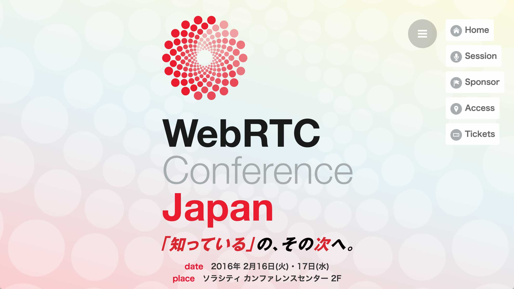

class: center, middle

# 大企業HACKS!

### 大企業で実現するイマドキのサービス開発

### .author[NTTコミュニケーションズ 技術開発部 大津谷亮祐]

???

操作方法

| key | action |
|:---:|:-------|
| `P` | プレゼンテーションモードのON/OFF切り替え |
| `C` | 子ウィンドウを開く |

---

class: center

# 大企業HACKS!とは

.x15[大企業をうまく利用して、 自由に、楽しく、かっこ良く、 新しいサービスを作る工夫]

???

- 「大企業ハック」は私が勝手に作った言葉
- 大企業をうまく利用して、より自由に、効率よく、楽しく、かっこよく働くための工夫
- 成功していない人の個人的見解なので、そういう前提で聞いてほしい

---

class: center

# プレゼンテーションのゴール

.x15[この中からイマドキのサービス開発に 挑戦する人が現れること]

すでに挑戦されている方とは、協力関係を築きたい    
それ以外の方には、働き方のヒントに使ってもらいたい

???

- こういうやり方もあるんだと思って、この中からもサービス開発に挑戦する人が現れる
- 同じような挑戦をされている方と、ノウハウを交換したり、協力したりしたい
- それ以外の方にも、仕事の時間を楽しくするためのヒントにしてほしい
- 大企業ハックはまだまだ未完成、ソフトウェアで言えばv0.1、コンセプトをコードにした段階
  - ぜひプレゼンテーションの後にフィードバックをいただいて、ディスカッションをしたい

---

class: center, middle

# 自己紹介

---

class: middle, no-margin

### 私のキャリアに影響を与えた3つのイノベーション

# 1. Web
# 2. iモード
# 3. iPhone

---

# 略歴

- 大学、大学院
  - ホンダで自動車を作ろうと思っていたが、    
    Webとiモードと出会い、進路を変える
- 1999年 [ドリーム・アーツ](http://www.dreamarts.co.jp)入社
- 2001年 NTT Com入社
    - 音楽配信、VOD、電子書籍
        - [MUSICO](http://musico.jp/)(TSUTAYAに売却)等
    - Webエンジニア、プロジェクトマネージャ
- 2012年 現職

???

- 大学、大学院時代に、最初の2つを経験
  - ホンダで自動車を作ろうと思っていたが、すっかり変わってしまった
- HXまで

---

background-image: url(attachments/webrtc-and-skyway-02.jpg)
background-position: center;
background-repeat: no-repeat;
background-size: contain;
class: hidden

---

background-image: url(attachments/webrtc-and-skyway-04.jpg)
background-position: center;
background-repeat: no-repeat;
background-size: contain;
class: hidden

# WebRTCとは

- WebRTC = __Web__ __R__ eal __T__ ime __C__ ommunication
- IPネットワーク上で (Web)    
  リアルタイムに (Realtime)    
  通信 & 意思疎通するための (Communication)    
  オープン標準

???

WebRTCとは、Web Real Time Communicationの略
IPネットワーク上でリアルタイムなコミュニケーション(意思疎通/通信)するためのオープン標準技術

---

background-image: url(attachments/webrtc-and-skyway-05.jpg)
background-position: center;
background-repeat: no-repeat;
background-size: contain;
class: hidden

???

- 最初のリアルタイムコミュニケーションは電話
- ベルさんが電話を発明してから120年間、電話会社が独占

---

background-image: url(attachments/webrtc-and-skyway-06.jpg)
background-position: center;
background-repeat: no-repeat;
background-size: contain;
class: hidden

???

- あとは、Skype、Winny、LINE
- スーパーハッカーが独占を崩す

---

background-image: url(attachments/webrtc-and-skyway-07.jpg)
background-position: center;
background-repeat: no-repeat;
background-size: contain;
class: hidden

???

- WebRTCが登場
- 参入障壁が下がる
- 誰でもリアルタイムコミュニケーションを扱える

---

background-image: url(attachments/webrtc-and-skyway-10.jpg)
background-position: center;
background-repeat: no-repeat;
background-size: contain;
class: hidden

???

- ブラウザだけでなくネイティブアプリでも利用できることなどが特徴
- 飛ばす
- IETFとW3Cで標準化
- プロトコル、NAT越えでP2P通信する手順、コーデック、ブラウザから利用するAPIの、４つが定められている
- プロトコルは温故知新、古いプロトコルの組み合わせ
- LTEでも使われているSCTPやSIPで使われるSDPなど

---

background-image: url(attachments/webrtc-and-skyway-11.jpg)
background-position: center;
background-repeat: no-repeat;
background-size: contain;
class: hidden

???

- SkypeやLINEとは、アプリやWebサイトの中に組み込める、埋め込める点が違う
- 家電やIoTの分野でも使われ始めている
  - Chromecast
    - TVに差すとパソコンの映像を飛ばして表示できる
  - おしゃれな見守りカメラ

---

background-image: url(attachments/webrtc-and-skyway-19.jpg)
background-position: center;
background-repeat: no-repeat;
background-size: contain;
class: hidden

???

- NAT越えでP2P通信するために、複雑な通信が必要
- 具体的には、最低でも3種類のサーバが必要
- ブラウザでも複雑なJavaScriptのプログラミングが必要
- iOS、Androidではオープンソースのビルドも必要

---

background-image: url(attachments/webrtc-and-skyway-20.jpg)
background-position: center;
background-repeat: no-repeat;
background-size: contain;
class: hidden

???

- そこで、SkyWayがサーバAPIとクライアントSDKを提供
- めんどくさいことを全部やってあげる
- WebRTCアプリの開発が簡単になる
- 2013年12月に提供開始し、3000アプリで利用
- 1秒に34アクセス
- 日本では独走、世界では2番手グループ

---

class: center

# SkyWayとは

???

- オンラインでサインアップし、GitHubからダウンロードして、すぐに利用できる

---

class: center

# デモ ビデオ会議

    

???

- URLを入れるだけでビデオ会議が始まる
- 8人まで参加できる

---

class: center

# デモ ロボット

???

- カーレースにも使ったり

---

class: center

# デモ [字幕付きボイスチャット](https://skyway.io/examples/caption-phone/#ja)

---

background-image: url(attachments/webrtc-and-skyway-35.jpg)
background-position: center;
background-repeat: no-repeat;
background-size: contain;
class: hidden

???

- ドコモGaccoの、Gaccatzという300人のオンライングループワーク
- ドコモでは他にも移動機開発部でも採用

---

background-image: url(attachments/webrtc-and-skyway-36.jpg)
background-position: center;
background-repeat: no-repeat;
background-size: contain;
class: hidden

---

background-image: url(attachments/webrtc-and-skyway-37.jpg)
background-position: center;
background-repeat: no-repeat;
background-size: contain;
class: hidden

???

- V-Sidoという人型ロボットを制御するOSの通信部分
- ソフトバンクグループ

---

background-image: url(attachments/webrtc-and-skyway-38.jpg)
background-position: center;
background-repeat: no-repeat;
background-size: contain;
class: hidden

---

# .center[SkyWay誕生の経緯]

| Date           | Event |
|:--------------:|:------|
| __2012/08__    | [小松健作氏](https://www.ntt.com/evangelist/)と2人体制 オープンソース公開の社内調整開始 |
| __2013/04__    | SkyWayのアイデア誕生 |
| __2013/07~09__ | SkyWayプロトタイプ開発 |
| __2013/10__    | オープンソース公開の許可が降りる |
| __2013/12__    | 公開 |
| __201?/??__    | 商用化? |

???

- 飛ばす
- 小松健作さんはHTML5の有名人
- 1人でやっていたチームに加わった

---

# アイデア誕生の瞬間

- <a href="http://blog.livedoor.jp/kotesaki/archives/1856455.html">WebRTCをお手軽に。Peer.js試してみた ― こてさきAjax</a>
- 小松さんがブログで、面白いWeb技術を紹介したり、サンプルを公開したりしていた
- その中でもWebRTCは行けると感じた

---

class: center

### WebRTC Conference Japan “日本にWebRTCのブームを起こしたい”

???

- 海外と日本で時差があった
- 2年前、海外ではWebRTCのスタートアップが買収されているのに、日本では誰も知らない
- CTO/CIO、情シス部長、スタートアップに、WebRTCを知ってもらいたい
- 日本にWebRTCのブームを起こしたいと考えて、カンファレンスをやった
- イベント会社はやってくれないから、実行委員会方式
- WebRTC関連企業に100万円ずつ出資してもらう
- イベント会社に託す

---

class: center, middle

# 本題

---

class: middle, no-margin

# 1.&nbsp;リーダーを決める
# .inactive[2.&nbsp;チームを作る]
## .inactive[ミッション・ステートメントと行動指針]
# .inactive[3.&nbsp;トライアルをやる]
# .inactive[4.&nbsp;商用化する]

???

- 4つのステップに分けて話す
- 最初はリーダーを決める
- 部門長クラス向けの話かも

---

# 凡例

.comment[Stay hungry, Stay foolish. .author[Whole Earth Catalog]]

- 吹き出しは誰かの言葉
- 出展が書いていないのは私の言葉

---

# リーダーを選ぶ

- リーダーの条件は、__技術への強い関心__と__サービス開発に対する情熱__を合わせ持つ人

.comment[大企業において、情熱には希少価値がある]

- 大企業で、30歳、40歳、50歳まで情熱を持ち続けている人は少ない
- 情熱のある人は影響力を発揮できる

---

# リーダーに力を与える

- 「力を与える」とは
  - 公式 または 非公式に権限を与えること
  - 非公式の例

.comment[今日から大津谷を課長と思って、言うことを聞け .author[内田健司 (元上司)]]

???

- リーダーを決めたら、力を与えなければならない
- 公式に権限を与える以外に、非公式に与える方法がある

---

# リーダーに力を与える

- 入社5年目で、3ヶ月で音楽配信サービスを立ち上げるプロジェクトのマネージャに任命された時に、部長から言われた言葉
- 大企業では、マネージャーになるまで何年もかかるが、20代~30代前半で実質的に経験できれば、優秀な若手のやる気につながる

???

- 非公式の例
- 読む
- 課長2人、主査2人、担当8人のチームにもかかわらず、みんな言うことを聞け
- ものすごいプレッシャーとやる気が湧き上がってきた
- 外資やスタートアップでは20代でなれることも
- 読む
- 私のチームでも若手をTech LeadやProduct Managerに任命しています

---

class: middle, no-margin

# .inactive[1.&nbsp;リーダーを決める]
# 2.&nbsp;チームを作る
## .inactive[ミッション・ステートメントと行動指針]
# .inactive[3.&nbsp;トライアルをやる]
# .inactive[4.&nbsp;商用化する]

???

- リーダー向けの話

---

# 参考：私の価値観

- 上司だから偉いと考えるのはよそう
  - どうしても必要なときだけ、権力を使おう

.comment[親だから、先生だから、敬えというのはおかしい。この人は信じても良い、この人の言うことは聞こう、と子供が決めること。 .author[[Telacoya921](http://www.telacoya921.com)]]

- では権力を使わずにどうやってチームを動かすか

???

- 私の価値観
- これは娘の通っていた幼稚園のファウンダーの言葉
- 上司部下でも同じだと思っている

(読む)

---

## 仕事を仕事のモチベーションに

- 権力を使わなくとも自律的に動いてほしい
- 大企業では給料をインセンティブにはできない
  - 仕事自体を仕事のモチベーションにしてもらう

.comment[マザー・テレサもガンジーも自己満足 .author[[BAGEL & BAGEL 林浩喜](http://www.attackers-school.com/gijiroku/detail-1363.html)]]

- 利他的な行動ができるのは、「やりたい」という利己的な思いがあるから

???

- BAGEL & BAGELの創業者がいいことを言ってる
  - マザー・テレサやガンジーも、自分がやりたいからやっている

---

## 仕事を仕事のモチベーションに

- 「ブラック企業みたい」という意見も
- 違いは、ルーチン・ワークのコスト削減のためにやるか、答えのない新しい問題に挑む知的労働者の能力を引き出すためにやるか

---

class: center

## 仕事を仕事のモチベーションに

    
この本にまとまっている

---

# モチベーションの3要素

.comment[内発的な動機の3つの構成要素――自律性、熟達、目的 .author[[ダニエル・ピンク]( http://www.amazon.co.jp/dp/4062144492)]]

- すなわち、
  - 自由とセルフコントロール
  - 何かを極める
  - 意義を感じられる
- その環境を作るのがリーダの仕事。

---

# 自由に働ける環境を作る

- 勤務制度
  - リモートワーク、フレックス、裁量労働、フリーアドレス、20%ルール、__ハッカソン__…
- オフィス環境
  - __ネットワーク__、良い椅子、大きいディスプレイ、コーヒー、おやつ…
- __ツール類__
  - GitHub, CI/CD, Slack, 自作アプリ…

---

## おまけ：社内ハッカソン

- 普段の仕事を離れ、自由な環境で、大いに能力を発揮しよう！
- 何を作るかも自由、時間も自由、メンバも自由。
- 20%ルールを定めたとしても、毎日2時間 または 週に1日を捻出するのは難しい。
- Atlassianの“Ship It! Day”(FedEx Day)やFacebookがモデル。
  「いいね!」もMessengerもタイムラインもハッカソンで生まれた。

---

## おまけ：ホンモノのインターネット

- 社内LANでできないこと。
  - SlideShareで勉強できない
  - LinkedIn、Facebookで連絡を取れない
  - Slackで繋がれない
  - GitHubを使ってチーム開発できない
- エンジニアはホンモノのインターネットを使うべき。
- みなさんの会社のネットワーク環境は大丈夫ですか？

---

## おまけ：ツール類

???

- Slack, GitHub, AWS, ZenDesk
- イマドキの当たり前のツールを使う

---

# 熱中できる仕事を作る

- 一人ひとりの価値観や得意分野を理解して仕事をアサインする
  - 仕事をアサインした時に興味を持てるか確認する    
    「楽しんでやれそう？」「やる気出る？」
- 好きなことをして、おまけに会社の役に立つ    
  好きなことをして、給料をもらえるとはありがたい    
  という状態を目指す

---

class: middle, no-margin

# .inactive[1.&nbsp;リーダーを決める]
# .inactive[2.&nbsp;チームを作る]
## ミッション・ステートメントと行動指針
# .inactive[3.&nbsp;トライアルをやる]
# .inactive[4.&nbsp;商用化する]

---

# 共感できるビジョンを示す

- ビジョン、目的、価値観を共有し、自分の意思で働いてもらう
  - 難しいが、やり続ける

.comment[日本人は納得しないと働かない .author[[日本IBM副会長 橋本孝之](https://ja.wikipedia.org/wiki/橋本孝之)]]

- エンジニアも同じ

---

### 例：SkyWayのミッション・ステートメント

.comment[ネットワーク、クラウド、電話というキャリアの強みを生かしながら、
WebRTCという新技術を使ったプラットフォームを開発・提供し、
WebRTCを活用したサービス開発を促して、
人と人のコミュニケーションを革新することによって、
世界をより良くすることに貢献する。]

---

### 例：[小松さん](https://www.ntt.com/evangelist/)壮行会の目的とゴール

.comment[__目的:__ 感謝の気持ちを伝え、新しい挑戦を応援する __目標:__ 涙あり笑いあり __コンセプト:__ 勉強会風 …]

.comment[飲み会に目的をや目標を設定するなんて、初めて見ました .author[NTT Com 本間咲来]]

???

- いい企画を考えると、みんなが楽しんでやれて、うまくいくという経験を何度もした

---

# 文化を作る

- チームの文化を作る
  - 変化や逆境に強い組織
- 行動指針を作って合意を形成し、浸透させる
  - 難しいが、やり続ける

---

### 例：WebコアTUの行動指針

1. 我々はチームで仕事をする
2. 我々は社内ベンチャーで、社内起業家だ。    
   命令されて動くのではなく、自らの意志で動く。
3. 我々はソフトウェアを開発する。

一部を紹介すると...

---

### 例：HRT (ハート)

- H: Humility (謙虚）

.comment[君は全知全能ではないし、絶対に正しいわけでもない。常に自分を改善していこう。 .author[[Team Geek](http://www.amazon.co.jp/dp/4873116309)]]

---

### 例：HRT (ハート)

- R: Respect (尊敬)

.comment[相手を1人の人間として扱い、その能力や功績を高く評価しよう。 .author[[Team Geek](http://www.amazon.co.jp/dp/4873116309)]]

---

### 例：HRT (ハート)

- T: Trust (信頼)

.comment[自分以外の人は有能であり、正しいことをすると信じよう。そうすれば、仕事を任せることができる。 .author[[Team Geek](http://www.amazon.co.jp/dp/4873116309)]]

---

### 例：HRT (ハート)

.comment[ジェフ、いつかわかる日が来ると思うが、賢くなるよりもやさしくなるほうがはるかに難しいことなのだよ .author[[ジェフ・ベゾスの祖父](http://logmi.jp/6726)]]

???

- 別の言い方の例
- 優秀だけど、人間関係を乱して、生産性を下げる振る舞いをするはいらない

---

### 例：自分の周りから良くする

- 大企業全体を変革するには時間がかかる。自分の周りから良くしていこう。

.comment[Think Globally, Act Locally]

.comment[自分の力が及ぶ範囲に集中する。どうしようもないことは気にしない。 .author[[ソラコム 玉川憲](https://www.facebook.com/KenTamagawa/posts/10155031038870054)]]

- 全体最適を考えなくていいとは言っていない。    
  理想を考えるのは大事だが、こだわりすぎない。

???

- なぜなら、社長ではないのだから。

---

### 例：許可より謝罪

.comment[許可を求めるより、寛容に期待しよう。 .author[[Team Geek](http://www.amazon.co.jp/dp/4873116309)]]

.comment[許可より謝罪 .author[[nanapi けんすう](http://blog.livedoor.jp/kensuu/archives/54849996.html)]]

???

- 変えていくとき、前例のないことをやるときに気をつけること。

---

### 例：ギャップを楽しむ、多様性を楽しむ

- 歴史ある会社で、新しいことに取り組むことを楽しむ
- 安定を重視する会社で、フットワーク軽く変化を起こすことを楽しむ
- 国内事業が中心の会社で、グローバルな仕事を楽しむ
- 頭の固い人にムカついたら「今日はこんな妖怪を見つけた」とネタにする

.comment[これ絶対に妖怪のせいだよ！ .author[妖怪ウォッチ 天野景太]]

???

- 昔はいちいち怒ってた
- 今はネタにできるようになった
- 主流と違うことをやってるんだから楽しむ

---

### 例：インプットだけでなくアウトプットも

- 社内__外__のカンファレンスや勉強会に参加し発表する
- 人にわかりやすく伝えることで理解が深まる
- 社外の人からフィードバックが得られる
- プロダクトの、組織の、エンジニア個人の、知名度が上がる
  - これがまわりまわって採用に効いてくる

---

### 例：リーダシップとリードされるシップ

- 全員が(最低限の)リーダーシップを備えるべき
    - 小さなリーダシップが要求される場面は多い
        - Scrum Master
        - ミーティングの司会
- 「リードされるシップ」がリーダシップを育てる
    - マイクロマネジメントや先輩風を慎む
    - 温かい目で見守る、助け舟を出す

---

### 例：仕事を見える化する

- 原則すべての情報をURL付きで公開する
  - 資料、議事録、ソースコード…
- 情報を抱え込むことで権力を持とうとすることを防ぐ意味もある

.comment[Everything should have an URL. .author[[How GitHub Works](https://speakerdeck.com/cobyism/how-github-works-github-kaigi-tokyo-2014)]]

.comment[なんでもテキストに。そこに時間を使う。 .author[[伊藤直也](https://speakerdeck.com/naoya/rimotowakufalsehua)]]

---

### 例：集中することに集中する1

- 「フロー状態」
  - 心理学用語で、一つのことに没頭し、ほとんど瞑想状態になること
  - 幸福感で一杯になり時間の感覚がなくなる
  - 15分以上の精神集中が必要
  - しかも割り込みや騒音で簡単に終わる
- 15分に1回電話が鳴るオフィスでは、一度もフロー状態に入れない

---

### 例：集中することに集中する2

- 意識してフロー状態を作る
- 他人のフロー状態を壊さない
  - チャット等の非同期コミュニケーションを活用する

.comment[机の前に何時間座っていたかはどうでもいいことで、全神経を集中して仕事に取り組んだ時間が重要なのだ。 .author[[ピープルウェア](http://www.amazon.co.jp/dp/4822285243)]]

---

### 例：会議を注意深く設定する

- 会議は有用だが、高くつく。だから、濃く、短く。

.comment[<small><small>1.&nbsp;絶対に必要な人だけを呼ぶ。 2.&nbsp;アジェンダを作ってミーティング開始前に配布する。 3.&nbsp;ミーティングのゴールを達成したら時間前でも終了する。 4.&nbsp;ミーティングを順調に進める。 5.&nbsp;ミーティングの開始時間を強制的に中断される時間の前に設定する。</small></small> .author[[Team Geek](http://www.amazon.co.jp/dp/4873116309)]]

.comment[不要な会議を減らして、家族 (友人/恋人/ゲーム…) と過ごす時間を増やそう]

---

### 例：SkyWay開発チームの会議体

#### Before

- 週1回 2時間の定例会 (全員が進捗報告)

#### After (2年半の試行錯誤の末)

- 毎朝 15分以内の朝会 (昨日やったこと、今日やること、気付きを1分以内で)
- 隔週 2時間以内の定例会 (1議題15分、エントリー制)

---

### 例：良い人材を集める

- (大企業では難しいが) あらゆるチャネルを使う
  - 業務委託、派遣、中途、異動、社内公募、新卒、インターン…
- (大企業では難しいが) 自分で人を選ぶ
  - 口コミ、根回し…

???

- 良くない人材を集めない

---

### 例：良い人材を集める

.comment[Two Pizza Rule .author[[ジェフ・ベゾス](http://gihyo.jp/dev/column/newyear/2014/aws-reflect-2013)]]

- ピザ2枚を分け合えるくらいの人数、つまり10人くらいのチームがちょうどいい
- 「仕事 > 人」の状態を保つ
  - 仕事が少しあふれる状態なら、自然と優先度をつけるから、大事なことにフォーカスできる
- 「人が足りないから、誰かください」はアンチパターン
  - 自分で人を選べない

???

- 逆に、仕事が少なくて、人が余っているチームは不健全。
  - どうでもいい仕事に固執する。
  - 先輩が仕事を囲い込んで、後輩に任せない。
  - 仕事をやっているふりをすることが常態化する。

---

### 例：プロフェッショナルと仕事をする

- 好きだからやっている人、一流の人と仕事をする

[html5j ファウンダー 白石俊平氏](https://html5experts.jp/shumpei-shiraishi/)

---

class: middle, no-margin

# .inactive[1.&nbsp;リーダーを決める]
# .inactive[2.&nbsp;チームを作る]
## .inactive[ミッション・ステートメントと行動指針]
# 3.&nbsp;トライアルをやる
# .inactive[4.&nbsp;商用化する]

???

- ここまで面白かった？
- つまんなかった？
- ここまでつまんなかった人は、ここからが大事
- 次はプロトタイプを作って
- トライアルに進む段階

---

## 何を作るか？

- マーケティングができるメンバも必要
- 後付けの理論だけでなく、ゼロから1を生む方法論も必要

???

- MBAで習うマーケティング理論は後付け
  - 結果をみて、法則を見つけようとする
- 0から1を生む方法論も、両方大事

---

## 「ありそうで、なかったもの」を作る

.comment[「ありそうで、なかったもの」を見つける .author[[日本テレビ 五味一男](http://www.attackers-school.com/seminar/detail-1456.html)]]

- 0から1の理論の一例
- 「ありそうで、なかったもの」
  - 当たり前のアイデアに感じられるのが特徴
  - ATM、コンビニ、iモード、LINE、Square (iPhone決済)

---

## 「なさそうで、なかったもの」の罠

- 「なさそうで、なかったもの」
  - 斬新なので一見よさそうに見えるが、ニーズ自体が存在しない
  - NTTがやりがち！
- 「ありそうで、あったもの」
  - ニーズはあるが先行者が存在するので体力勝負に
  - NTTの場合、これはこれでありかも

???

- SkyWayは技術志向のプロダクト
- 自分のことは棚に上げて説明した

---

# 内製で作る

- SkyWayは内製を選んだ
- 理由は
  - ソフトウェアの重要性が増している
  - ソフトウェアの開発が容易になった
- コードが書きたくて、リスクを取って社内公募で異動してきた社員の存在も、理由の一つ

---

# ソフトウェアの重要性1

- ソフトウェア開発力が企業の競争力を左右する
  - AppleとSonyに差がついた理由の一つ
- 例えば変化に対応するスピードの違い。    
  外注の場合、変更依頼書→変更管理委員会→見積もり→価格交渉→決裁 … →コーディング

.comment[ソフトウェア開発は競争力の源泉 .author[[KDDI代表取締役会長 小野寺正](http://www.pp.u-tokyo.ac.jp/seminar/2013-11-07/index.htm)]]

---

# ソフトウェアの重要性2

- ソフトウェアがかつてのハードウェアの領域も担うようになってきた
  - フィーチャーフォンにはたくさんのボタンがあった
  - スマートフォンにはボタンがほとんどなく、    
    ソフトウェアでUIを書く

.comment[iPadを使っていると、目に見えるのはソフトウェアだけになる。 .author[[David Carr](https://maclalala2.wordpress.com/2010/02/11/ガジェットが姿を消す・・・/)]]

---

# ソフトウェア開発が容易に

- クラウドとAPIが出現
- ハードウェア、ネットワーク、汎用的な機能(認証、決済、RDB、DNS…)を自前で構築しなくてもよくなった

---

# 内製か外注か？

- 内製も外注も、目的達成のための手段。論理的に判断する。
- 開発方法は多様化
  - スーパーエンジニアを集めるGoogle, Facebook, Amazon, Apple…
  - オフショアを進めるAccenture, IBM…
  - クラウドソーシングも登場
  - 違いを意識しないと議論がかみ合わないことも…

---

## フィールドトライアルという魔法

- 大企業で新しいサービスを始めるのは大変
- どうやって事業化する？
- R&Dには「フィールドトライアル」という魔法がある
- 社内には「フィールドトライアルです」    
  社外には「β版です」

???

- 今日一番大事な話

---

# 最初から完璧を求めない

- 2013年に海外のWebRTCのカンファレンスに行って驚いたこと
  - コンセプトとモックアップしか無いのに、堂々とプレゼンをしている、ブースを構えている
- 日本人が考える「プロトタイプ」の方がはるかに上
- とりあえず出してみる

---

class: middle, no-margin

# .inactive[1.&nbsp;リーダーを決める]
# .inactive[2.&nbsp;チームを作る]
## .inactive[ミッション・ステートメントと行動指針]
# .inactive[3.&nbsp;トライアルをやる]
# 4.&nbsp;商用化する

???

- 最後に商用化の話
- まだ商用化していない
- このストーリーはまだ完結していない

---

# 商用化のキャズム(溝)

- R&Dでは、トライアルと商用化の間に大きな溝がある
- フィールドトライアルの魔法が効かない
- SkyWayも、もうすぐ2年が…
- どうやって商用化のキャズムを越えるか？

---

# 社外で実績を作る

- 社外で先に実績を作ってしまう
- 社外のお客様の声を利用して、社内を動かす
  - 「SkyWayについて知りたい」
  - 「Comにこんな面白いものを見せてもらえるとは思わなかった」
  - 「有償で使いたい」
  - 「価格がわからないと、投資判断ができない」

---

# 社外で実績を作る

- 社外の声で、営業が熱くなり、プロダクト部門が熱くなる
  - 「今までのお客様訪問で一番楽しかった」
  - 「一緒にプロダクト部門を説得しますよ」
- トライアルであっても、商用サービスと同じ覚悟を持って、商用品質で運用する

---

class: center

# まとめ

.x15[大企業をうまく利用して、 自由に、楽しく、かっこ良く、 新しいサービスを作る工夫]

---

class: center

# 最後に

.x15[夢みたいに聞こえるかもしれないが、 NTT Comでもできるのだから、 あなたの会社でも絶対にできる。]

WebRTCとSkyWayもよろしくお願いします！

???

- D社には何より実績がある。
